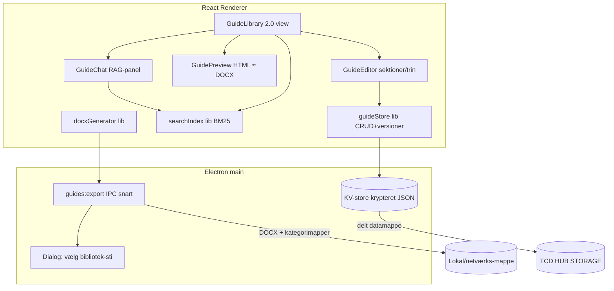
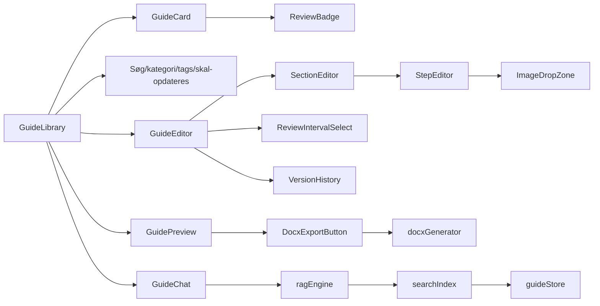

# Guide Bibliotek 2.0 — Arkitektur & Implementeringsplan (til release 1.4.0)

Status: **UNDER UDVIKLING — del af 1.4.0, må ikke releases før alt er godkendt.**

## Krav-resumé
1. **Guide Editor**: tekst, billeder, kategorier, tags, trin-for-trin sektioner, versionering.
2. **Dokumentgenerator**: professionel DOCX efter fast template (kopi af `DESK3500 - ENG-.docx`-layoutet), automatisk forside, indholdsfortegnelse, sidenummerering, versionsnummer, standardiserede overskrifter og billedplacering.
3. **Preview**: HTML-rendering i appen, der ligner den genererede DOCX.
4. **Lokalt guidebibliotek**: brugervalgt lagringssti (lokal/netværk), automatisk kategoristruktur.
5. **AI Chatbot (RAG)**: viden KUN fra guidebiblioteket, indeksering, relevansscore, citater af afsnit/trin, åbn guide direkte.
6. **Søgning**: fritekst, tags, kategorier, semantisk (lokal BM25 + synonymer — ingen ekstern AI-tjeneste tilgængelig).
7. **UX**: moderne UI, hurtig navigation, mørkt/lyst tema (findes), drag & drop af billeder.
8. **Arkitektur**: skalerbar, modulær, klar til SharePoint/OneDrive/Teams-integration senere.
9. **Vedligeholdelses-timer (NYT)**: valgfrit opdaterings-interval pr. guide (fx 1/2/3/6 mdr. eller 1 år — ELLER intet interval). Kan sættes ved oprettelse OG redigeres/tilføjes senere. Biblioteket viser hvornår guides skal opdateres, så alt holdes up-to-date.

## DOCX-template spec (analyseret fra DESK3500 - ENG-.docx)
- **Side**: A4 portræt (11906×16838 twips), marginer 720 twips (1,27 cm) hele vejen rundt, header/footer 708.
- **Fonte**: Theme = Calibri Light (overskrifter) / Calibri (brødtekst).
- **Side 1**: `TOCHeading`-afsnit + TOC-felt `TOC \o "1-3" \h \z \u`, derefter centreret forsidebillede (~4,2″×5,7″), så sideskift.
- **Sektioner**: `Heading3`-stil, farve `#1F3763`, 12 pt, keepNext/keepLines — nummereret **"%1.0"** (1.0, 2.0, 3.0 …).
- **Trin**: `ListParagraph` (indrykning 720), nummereret **"X.Y"** hvor X = sektionsnummer (templaten bruger separate numIds pr. sektion med hardcodet præfiks — vi genererer én numbering-instans pr. sektion på samme måde).
- **Billeder i trin**: inline, centreret eller efter trin-tekst.
- **Header (standard-sider)**: logo (gemt: `src/assets/images/docx/header-logo.png`), forfatternavn, "«Titel», Merchant Services", "Version X.XX". Første-side-header er tom (titlePg).
- **Footer**: tom i templaten (kun auto-klassifikations-label fra corporate Word). Krav om sidenummerering opfyldes med diskret `PAGE`-felt nederst til højre (tilføjelse ift. template).
- **Metadata**: dc:creator = forfatter.
- TOC opdateres automatisk ved åbning i Word via `updateFields`-setting.

## Systemarkitektur

Fremtidig SharePoint/OneDrive/Teams: `guideExporter` er et interface (`ExportTarget`) — filesystem-target nu, Graph-API-targets senere uden ændringer i UI/domænelag.

## Datamodel (KV-nøgler)
```ts
// KV 'guides' (v2 — migreres fra v1 ved første load)
interface Guide {
  id: string
  schemaVersion: 2
  title: string
  category: string
  tags: string[]
  coverImageId?: string          // fileStorage-id
  sections: GuideSection[]       // trin-for-trin struktur
  version: string                // "1.00" — bumpes ved hver gemning (minor) / manuelt major
  author: string                 // email
  createdAt: number; createdBy: string
  updatedAt: number; updatedBy: string
  reviewIntervalMonths: number | null  // null = intet interval (1|2|3|6|12)
  nextReviewAt: number | null          // updatedAt + interval; null hvis intet interval
  lastReviewedAt?: number              // "Markér som gennemgået" resetter timer uden indholdsændring
  // v1-kompatibilitet (Word-upload bevares som bilag):
  legacyContent?: string; wordFileName?: string; fileSize?: number
}
interface GuideSection { id: string; heading: string; intro?: string; steps: GuideStep[] }
interface GuideStep { id: string; text: string; imageIds: string[] }

// KV 'guide-versions-{guideId}' — historik holdes UDE af 'guides' (ydelse)
interface GuideVersionEntry { version: string; savedAt: number; savedBy: string; changeNote?: string; snapshot: Pick<Guide,'title'|'category'|'tags'|'sections'|'coverImageId'> }

// KV 'guide-library-settings' — eksport-bibliotek
interface GuideLibrarySettings { exportRoot: string | null }  // fx M:\...\Userguides

// Billeder genbruger eksisterende fileStorage (file_{id}_meta/_chunk_{n}, 256KB chunks)
```
Migrering v1→v2: gammel `content` → én sektion "Indhold" med ét trin (teksten), `schemaVersion: 2`, `version: "1.00"`, `reviewIntervalMonths: null`. Kører lazy ved load, skrives kun tilbage ved første gemning.

## Komponentdiagram


## UI-mockups (skitser)
**Bibliotek** — kort med vedligeholdelses-status:
```
┌──────────────────────────────────────────────────────────────┐
│ [Søg…]  [Kategori ▾] [Tags ▾] [☑ Skal opdateres]  [+ Ny guide]│
├──────────────┬──────────────┬──────────────┬─────────────────┤
│ DESK3500     │ Terminal XYZ │ Retur-flow   │ …               │
│ Prepare v1.02│ Setup  v2.10 │ HR     v1.00 │                 │
│ 🔴 Overskredet│ 🟡 Om 12 dage│ ⚪ Intet     │                 │
│ [Åbn][⚙][📄] │              │ interval     │                 │
└──────────────┴──────────────┴──────────────┴─────────────────┘
```
**Editor** — sektioner/trin + interval:
```
Titel [___________]  Kategori [▾]  Tags [___]  Forsidebillede [drop]
Opdaterings-interval [Intet ▾]  (Intet | 1 md | 2 mdr | 3 mdr | 6 mdr | 1 år)
── Sektion 1.0 [Overskrift____________] [↑↓✕]
   Trin 1.1 [tekst…] [🖼 drop billeder her]
   Trin 1.2 [tekst…]
   [+ Trin]
[+ Sektion]        Versionsnote [____]   [Gem (→ v1.03)]
```
**Preview**: A4-lignende hvidt ark, TOC, "1.0 Overskrift", "1.1 trin", billeder — samme rækkefølge/nummerering som DOCX. Knapper: [Download DOCX] [Eksportér til bibliotek] [Markér som gennemgået].
**Chat**: svar med citatkort "DESK3500 §2.3: 'Scan the serial number…' (score 87 %) [Åbn guide]".

## Søgning & RAG (lokalt, ingen ekstern AI)
- `searchIndex`: tokenisering (da/en stopord, stemming-let), BM25 over chunks = {guide, sektion, trin}. Indeks caches i memory og genbygges ved `guides`-ændring (subscribe).
- Fritekst/tags/kategori = filtre ovenpå. "Semantisk" = BM25 + dansk/engelsk synonymordbog (fx terminal≈betalingsterminal) + fuzzy (Levenshtein ≤2).
- `ragEngine.ask(q)`: top-k chunks m. score → svar bygget af citater med sektions-/trin-numre + åbn-knap. Ingen hallucination: svarer kun med guide-uddrag; siger til hvis intet match.

## Tekniske valg (begrundelser)
| Valg | Begrundelse |
|---|---|
| `docx` npm-pakke (renderer, ren JS) | Kan generere OOXML m. styles/numbering/TOC-felt/headers präcist som templaten; ingen Word/COM nødvendig (brugere uden admin-rettigheder) |
| TOC som Word-felt + `updateFields` | Word beregner sidetal korrekt ved åbning — eneste pålidelige måde uden Word-engine |
| Numbering pr. sektion (X.Y-hack som templaten) | Garanterer trin-numre matcher sektionsnummer, identisk med DESK3500 |
| Versioner i separat KV-nøgle pr. guide | 'guides'-listen forbliver lille → hurtig load/sync over netværksdrev |
| BM25 lokalt frem for embeddings | Ingen server/API tilgængelig; BM25+synonymer giver god relevans offline og er deterministisk |
| Billeder via eksisterende fileStorage-chunks | Genbrug, krypteret, virker over delt drev |
| `ExportTarget`-interface | SharePoint/OneDrive/Teams kan tilføjes som nye targets (Graph API) uden refaktor |
| Preview = samme layoutmodel som generator | Én kilde til sandhed (`guideToDocModel()`) bruges af både HTML-preview og DOCX |

## Implementeringsplan
### Fase 1 — Datamodel, migrering & Guide Editor 2.0
- [x] `src/lib/guideTypes.ts` (Guide v2, sektioner/trin, versioner) + migrering v1→v2
- [x] `src/lib/guideStore.ts` (CRUD, versions-bump, gem snapshot i `guide-versions-{id}`, reviewInterval/nextReviewAt-logik)
- [x] Ny `GuideEditor.tsx`: sektioner/trin (tilføj/flyt/slet), drag & drop-billeder (fileStorage), forsidebillede, kategori/tags
- [x] Interval-vælger (Intet/1/2/3/6/12 mdr.) i editor — både ved oprettelse og redigering af eksisterende
- [x] Versionshistorik-panel (liste + gendan)
- [x] Ekstra: `fileStorage.uploadImage()`/`getImageObjectUrl()` (billeder i chunked KV m. objekt-URL-cache); GuideViewer viser nu sektioner/trin m. numre, billeder, version- og interval-badge; App sender userEmail til GuideLibrary
- Note: gammel `GuideDialog.tsx` er ikke længere monteret (bulk-Word-import kan genindføres i senere fase hvis ønsket)
### Fase 2 — Bibliotek 2.0 & vedligeholdelse
- [x] GuideLibrary-view: nye kort m. version + review-badge (🔴 overskredet / 🟡 <14 dage / ⚪ intet interval)
- [x] Filter "Skal opdateres" (m. antal), sortering efter nextReviewAt (mest presserende først)
- [x] "Markér som gennemgået"-handling (resetter timer uden versionsbump) — knap på kort ved overskredet/snart-deadline
### Fase 3 — Preview & DOCX-generator
- [x] `src/lib/docModel.ts`: `guideToDocModel()` (fælles model for preview+DOCX) + `resolveAuthorName()`
- [x] `GuidePreview` (implementeret som opgraderet `GuideViewer.tsx`): A4-HTML-rendering — header-strip m. logo/forfatter/titel/version, indholdsfortegnelse, forsidebillede, sideskift-markering, 1.0/1.1-numre, trin-billeder; lys "Word-agtig" visning uanset tema
- [x] `npm i docx` (9.7.1) + `src/lib/docxGenerator.ts` efter template-spec (A4/marginer, TOC-felt m. updateFields, multilevel-nummerering %1.0/%1.%2, Heading3 #1F3763 Calibri Light, header m. logo+forfatter+"Titel, Merchant Services Version X.XX", tom førsteside-header (titlePg), PAGE-felt i footer, centrerede skalerede billeder, dokument-metadata)
- [x] Download-knap i preview — docx-pakken lazy-loades (egen chunk, 364 KB) så app-opstart ikke påvirkes
- [ ] Manuel verifikation i Word mod DESK3500 (kræver bruger-smoke-test)
### Fase 4 — Lokalt guidebibliotek (eksport)
- [x] IPC `guides:choose-export-dir` + `guides:export-docx` (main: skriv DOCX til `<rod>/<kategori>/<titel> vX.XX.docx`, opret mapper, path-traversal-værn)
- [x] `src/lib/guideExporter.ts` m. `ExportTarget`-interface (filsystem nu; SharePoint/OneDrive/Teams kan tilføjes som nye targets) + KV `guide-library-settings`
- [x] Eksport-dialog i GuideLibrary (vis/skift mappe, "Eksportér alle" m. fremdrift og fejlopsamling)
- [x] "Eksportér til bibliotek"-knap i preview (vælger mappe første gang)
- Note: eksport-knapper vises kun i desktop-appen (window.electronGuides)
### Fase 5 — Søgning
- [x] `src/lib/searchIndex.ts` (BM25 over chunks m. da/en-stopord, let stemming, domæne-synonymer, fuzzy Levenshtein ≤2) — genbygges automatisk via useMemo når guides ændres (useKV-subscribe)
- [x] Søge-UI: BM25-rangeret bibliotekssøgning m. substring-fallback; match-uddrag på kort m. §-reference + relevans-%; tag/kategori-filtre bevaret
### Fase 6 — AI Chatbot (RAG)
- [x] Retrieval-logik indbygget i `GuideChat.tsx` via BM25-indekset (top-chunks m. min-relevans-tærskel)
- [x] Ny `GuideChat.tsx` (erstatter slettet, u-monteret ChatAssistant): citatkort m. guide-titel, §-reference, citat, relevans-% og [Åbn guide] — svarer KUN med guide-citater (ingen hallucination); flydende chat-knap i biblioteket
### Fase 7 — Polering & validering
- [x] Editor-vindue forstørret til næsten fuldskærm (96vw × 94vh, felter i 4-kolonne-grid på store skærme)
- [x] Inline kategori-oprettelse i editoren (+-knap ved kategori-vælgeren, gemmes i delt categories-KV)
- [x] Sprog pr. guide (da/en, auto-detekteres ved gemning) + ordbogsbaseret da↔en-oversætter (`src/lib/translator.ts`, domæne-ordbog): DA/EN-toggle i preview (oversætter også DOCX-eksport af vist sprog, markeret "Automatisk oversat"), tosproget søgning (ordbogen indgår i BM25-synonymer) og chatbot der svarer på spørgsmålets sprog m. oversatte citater
- [x] Ydelse: BM25-indeks og doc-model memoiseret; docx-pakke lazy-loaded i egen chunk; objekt-URL-cache for billeder. (Virtualiseret liste udeladt — unødvendigt ved realistisk guide-antal)
- [x] `npm test` (10/10) + `npm run build` — kørt grønt efter hver fase
- [ ] Manuel smoke-test (BRUGER): opret guide m. sektioner/billeder → preview → Download DOCX → åbn i Word og sammenlign med DESK3500 (TOC opdateres ved åbning) → eksportér til M:-drev → chat-spørgsmål m. citater
- [ ] Migrationstest med eksisterende guides.json fra TCD HUB STORAGE (åbn biblioteket i appen — v1-guides skal vises uændret og få v2-struktur ved første redigering)

**Anbefaling: start med Fase 1.**
